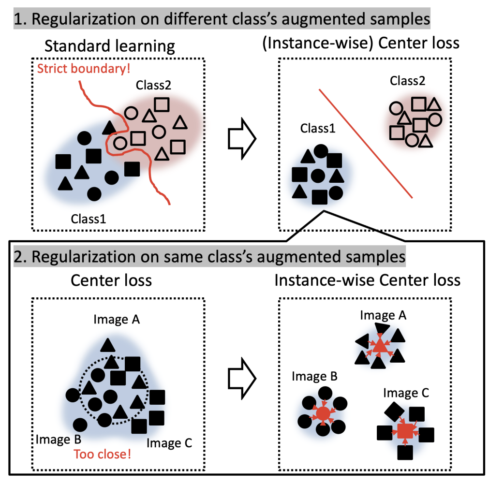
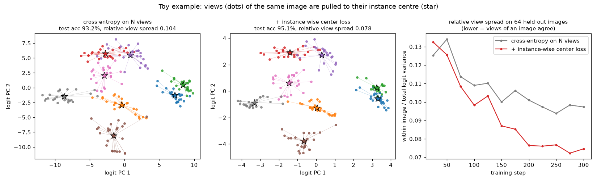

# Instance-wise Center Loss for Efficient Training of Deep Convolutional Neural Networks

Official PyTorch implementation of the paper *Instance-wise Center Loss for Efficient Training of Deep Convolutional Neural Networks* (IEEE GCCE 2022).

[Koki Madono](https://madonokouki.github.io/), Masayuki Tanaka, Masaki Onishi

[](https://madonokouki.github.io/projects/instance-center-loss/)
[](https://ieeexplore.ieee.org/document/10014037)
[](LICENSE)
[](https://www.python.org/)
[](https://pytorch.org/)
[](https://github.com/MADONOKOUKI/gcce2022_instancewise_center_loss/actions/workflows/tests.yml)
[](https://colab.research.google.com/github/MADONOKOUKI/gcce2022_instancewise_center_loss/blob/main/notebooks/quickstart.ipynb)

<p align="center"></p>

**TL;DR** Train on N augmented views of every image and, besides the cross-entropy, pull the logits of each view towards the mean logits of the views of the *same* image. Unlike the class-wise center loss, which squeezes all samples of a class together, this only asks the network to give consistent outputs for different augmentations of one image. It is one loss term without extra parameters. In the paper it gives the best accuracy in every tested setting (ResNet-18, ResNeXt-29 and WideResNet-28-10 on CIFAR-10, CIFAR-100 and CUB-200), compared with center, contrastive-center and triplet losses and the JS-divergence of AugMix, with the largest gains on small and fine-grained training sets.

## News

- 2026-10: Code refactored into an installable package with a Colab quick start; the original research code is kept in [`archive/`](archive/).

## Installation

```bash
git clone --depth 1 https://github.com/MADONOKOUKI/gcce2022_instancewise_center_loss.git
cd gcce2022_instancewise_center_loss
pip install -e .
```

The repository also keeps about 2.2 GB of archived training logs (`archive/results*/`). To skip them, clone the code only:

```bash
git clone --depth 1 --filter=blob:none --sparse https://github.com/MADONOKOUKI/gcce2022_instancewise_center_loss.git
cd gcce2022_instancewise_center_loss
git sparse-checkout set --no-cone '/*' '!/archive/results*/'
pip install -e .
```

To use only the package: `pip install git+https://github.com/MADONOKOUKI/gcce2022_instancewise_center_loss` (this downloads the whole repository once). Requirements: Python ≥ 3.9, PyTorch ≥ 1.13, torchvision, NumPy, SciPy, Pillow, PyYAML, Matplotlib.

## Quick start

```python
import torch
from torchvision import transforms as T
import iwcl
from iwcl.models import build_model

model = build_model("resnet18", num_classes=100)                # any classifier works; this one returns (logits, features)
criterion = iwcl.InstanceWiseCenterLoss(alpha=0.7)              # alpha = lambda_IC (0.7 for ResNet-18 in the paper)
augment = T.Compose([T.RandomCrop(32, padding=4), T.RandomHorizontalFlip()])
images, labels = torch.rand(8, 3, 32, 32), torch.randint(0, 100, (8,))   # a batch of your data

views = iwcl.make_views(images, augment, num_views=2)           # (N, B, 3, 32, 32)
logits = torch.stack([model(v)[0] for v in views])              # (N, B, 100)
loss = criterion(logits, labels)                                # cross-entropy + pull to the instance centre
loss.backward()
```

With a torchvision dataset, `transform=iwcl.MultiViewTransform(train_transform, num_views=2)` makes the data loader return a list of N views per batch instead.

**The loss (Sec. II of the paper).** Each image $x_i$ of a mini-batch $B$ is augmented $N$ times, $g_{\eta_n}(x_i)$, and the network $h_\theta$ gives the logits of every view. The instance-wise centre is the mean logit vector of the views of one image (Eq. 2), the instance-wise center loss is the squared distance of every view's logits to its centre, which is treated as a constant (Eq. 6), and the training loss mixes it with the cross-entropy averaged over all views (Eqs. 3-4):

$$c_i = \frac{1}{N}\sum_{n=1}^{N} h_\theta(g_{\eta_n}(x_i)),\qquad \mathcal{L}_{IC} = \frac{1}{|B|N}\sum_{i\in B}\sum_{n=1}^{N}\big\lVert h_\theta(g_{\eta_n}(x_i)) - \mathrm{StopGrad}(c_i)\big\rVert_2^2,\qquad \mathcal{L} = (1-\lambda_{IC})\,\mathcal{L}_{CE} + \lambda_{IC}\,\mathcal{L}_{IC}.$$

The paper uses $N=2$ (3 in Table II) and $\lambda_{IC}=0.7$ for ResNet-18 and $0.5$ for ResNeXt-29 and WideResNet-28-10. `InstanceWiseCenterLoss` computes exactly this, with two implementation details taken from the released code: the squared distance is also averaged over the $C$ logits, as `torch.nn.MSELoss` does (`reduction="sum"` gives the plain sum of Eq. 6; see the notes below), and the other distances of Table IV are available as `distance="l1"`, `"huber"` (δ = 1) and `"kl"`. Because the centre is the mean of the views, the stop-gradient leaves the gradient of the L2 and KL distances unchanged; it only matters for L1 and Huber. Images labelled `-1` get no cross-entropy but still enter $\mathcal{L}_{IC}$, and `center_on="features"` pulls the pooled features instead of the logits.

**Toy example.** `python examples/quickstart.py` trains a tiny CNN on synthetic 16x16 images twice, with cross-entropy on N=4 views and with the instance-wise center loss, and writes [`assets/quickstart.png`](assets/quickstart.png). It runs on a CPU and downloads nothing. It printed:

```
cross-entropy on N views     test acc  93.2%  relative view spread 0.104
+ instance-wise center loss  test acc  95.1%  relative view spread 0.078
```



The same code runs in [`notebooks/quickstart.ipynb`](notebooks/quickstart.ipynb) (Open in Colab above). The toy example only illustrates the idea; it is not a result of the paper.

## Reproducing the paper

```bash
bash scripts/reproduce_table1.sh                 # Table I:  3 models x 3 augmentations x 5 methods on CIFAR-10/100 and CUB-200 (N=2)
bash scripts/reproduce_table2.sh                 # Table II: ResNet-18, N=3, JS-divergence vs. ours with 4 augmentations
bash scripts/reproduce_table3.sh                 # Table III: ResNet-18 + AutoAugment on 100 / 500 / 1000 CIFAR-10 images
bash scripts/reproduce_table4.sh <dataset>       # Table IV: L1 / Huber / KL / L2 distances (the paper does not name the dataset)
python scripts/summarize_runs.py runs            # mean ± std over the three seeds of every setting
```

Each script runs `train.py` three times per setting (seeds 1-3; the paper reports the mean of three runs) and accepts extra `train.py` flags, e.g. `--num-workers 8`. A single run:

```bash
python train.py --dataset cifar100 --model resnet18 --augmentation cutout --method proposed      # lambda_IC = 0.7 for ResNet-18
python train.py --dataset cifar10 --model wideresnet --augmentation autoaug --method baseline    # "None" in the tables
python train.py --dataset fake --model resnet18 --epochs 1 --batch-size 32 --num-workers 0      # smoke test on synthetic data, no download
```

The defaults of `train.py` are the settings of Sec. III-A of the paper: SGD with momentum 0.9 for 200 epochs, learning rate 0.1 divided by 10 at epochs 60, 120 and 180, weight decay 5e-4, 256 images per step (on four GPUs in the paper; `--data-parallel` uses all visible GPUs), N = 2 views, λ_IC = 0.7 for ResNet-18 and 0.5 otherwise, λ = 0.1 for the center, contrastive-center and triplet losses, and the AugMix code's settings for the JS-divergence. All images are resized to 32x32. Each step forwards the N views separately, so a run costs about N times standard training; we have not re-run the paper's experiments for this release. Every run writes `metrics.csv` (per-epoch loss and accuracy), `summary.json` (best-epoch and final test accuracy; the paper does not say which of the two it reports), `best.pt` and a resumable `last.pt` (`--resume`) to `runs/<setting>/`. `python train.py --config configs/example.yaml` reads defaults from a YAML file.

| option | values (default first) |
|---|---|
| `--dataset` | `cifar100`, `cifar10`, `cub200` (see below), `svhn`, `stl10`, `fake` |
| `--model` | `wideresnet` (WRN-28-10), `resnet18`, `resnext` (ResNeXt-29 8x32d; `--resnext-base-width 64` gives the release's 8x64d), `densenet`, `shakeshake` (the last two are not in the paper) |
| `--augmentation` | `cutout`, `standard` (flip and cropping), `autoaug`, `augmix`, `randaug` (not in the paper) |
| `--method` | `proposed`, `baseline` ("None"), `center_loss`, `contrastive_center_loss`, `triplet_loss`, `jsd` (AugMix's JS-divergence, 3 views) |
| `--num-views`, `--lambda-ic` | 2; 0.7 for ResNet-18, else 0.5 |
| `--distance`, `--stopgrad`, `--ic-reduction` | `mse` (L2), `l1`, `huber`, `kl`; on; `mean` (release) or `sum` (Eq. 6) |
| `--subset-per-class` | 0 = all images; 10 / 50 / 100 per class for Table III |

**CUB-200-2011** is not downloaded automatically. Download `CUB_200_2011.tgz` from the [Caltech-UCSD Birds-200-2011 page](https://www.vision.caltech.edu/datasets/cub_200_2011/), extract it and pass the extracted `CUB_200_2011` directory: `python train.py --dataset cub200 --data-root /path/to/CUB_200_2011` (or `CUB_ROOT=/path/to/CUB_200_2011 bash scripts/reproduce_table1.sh`). The official split of `train_test_split.txt` is used (5,994 training and 5,794 test images), resized to 32x32.

<details>
<summary>Notes on the paper, the released code and this implementation</summary>

`tests/` checks the loss against the equations of the paper and against the loss of the released code, and checks the comparison losses, all networks (with the same weights) and the Cutout/AutoAugment/AugMix pipelines (with the same seeds) against the archived code. Where the paper and the released code (`archive/release_2023/`) differ, the defaults follow the paper:

- **Hyper-parameters.** The release configuration used λ_IC = 0.5 for every model, 512 images per step (128 per GPU on four GPUs) and weight decay 1e-4 for ResNet-18 and ResNeXt; `train.py` uses the paper's values listed above. Nesterov momentum is kept from the release configuration (the paper does not mention it).
- **ResNeXt-29.** The paper uses 8x32d; the released code built 8x64d. The default is 8x32d and `--resnext-base-width 64` reproduces the released network.
- **Normalisation of L_IC.** Eq. 6 sums the squared differences over the logits; the released code used `torch.nn.MSELoss`, which also divides by the number of classes. Table IV refers to PyTorch's default Huber setting, so the PyTorch losses with their default averaging are kept (`--ic-reduction mean`); `--ic-reduction sum` implements Eq. 6 literally and makes the term C times larger.
- **KL distance.** The released code combined the KL distance as CE + KL, without λ_IC and without the stop-gradient. Here every distance is weighted by λ_IC as in Eq. 3 (Table IV uses λ_IC = 0.1 for all distances). CE + KL equals twice the loss with λ_IC = 0.5, and the stop-gradient does not change the KL gradient.
- **Stop-gradient.** On by default, as in Eq. 6 and in the released code for L2, L1 and Huber (an older configuration listed `stopgrad: False`).
- **Training subset.** The released `dataset/cifar.py` still subsampled the training set as in Table III (10 random images of each of the classes 0-9, unseeded). `train.py` uses the full training set; `--subset-per-class 10/50/100` selects 100/500/1000 CIFAR-10 images for Table III (seeded, all classes).
- **CUB-200 and resizing.** The released code has no CUB-200 loader and resized images with `Resize(32)` (shorter side); here every image is resized to 32x32 as stated in the paper, which is the same for the square CIFAR images.
- **Views.** The release datasets returned ten transformed copies of every image, the fifth un-augmented on CIFAR, so runs with N ≥ 5 on CIFAR had one clean view; `train.py` creates exactly N augmented views (JS-divergence: the clean image and two augmented views, as in the release).
- **Comparison methods.** As in the released code, the triplet loss acts on the logits (`--triplet-on features` uses the features instead), and the contrastive-center-loss centres were created with `nn.Parameter(...).cuda()`, which returns a plain tensor, so they were never trained; this is reproduced by default and `--learnable-centers` trains them. The feature size of both centre losses, hard-coded in the release, is read from the model. The JS-divergence is computed from log-probabilities: the same value, but with finite gradients when a probability underflows to zero, where the original form gives NaN.
- **Augmentations.** torchvision's AutoAugment, RandAugment and AugMix use different operations and magnitudes, so the implementations used by the release are ported ([`iwcl/augment.py`](iwcl/augment.py)); there is no mean/std normalisation, as in the release.
- **Other.** The seed is applied (the release configuration had `seed: 1` but never set it), unused classifier heads are dropped, STL-10 (not in the paper) uses its labelled split because the release passed the label -1 of its unlabelled images to the cross-entropy, and DenseNet (not in the paper) returns log-probabilities as in the release.

</details>

## Results

All numbers are from the paper: test accuracy (%), the mean and, where the paper gives it, the standard deviation over three runs; bold marks the best result of each setting, as in the paper.

**Table I of the paper: two augmented views (N = 2).** Summary without regularization (None) and with the instance-wise center loss (Ours):

| Model | Augmentation | CIFAR-10 None | CIFAR-10 Ours | CIFAR-100 None | CIFAR-100 Ours | CUB-200 None | CUB-200 Ours |
|---|---|---:|---:|---:|---:|---:|---:|
| ResNet-18 | Flip & crop | 94.31 ± 0.21 | **95.23 ± 0.04** | 74.87 ± 0.38 | **77.46 ± 0.11** | 28.79 ± 0.12 | **32.19 ± 0.36** |
| ResNet-18 | Cutout | 94.37 ± 0.40 | **95.60 ± 0.00** | 76.00 ± 0.09 | **77.98 ± 0.19** | 31.17 ± 1.25 | **37.32 ± 0.21** |
| ResNet-18 | AutoAugment | 95.46 ± 0.10 | **95.90 ± 0.03** | 77.19 ± 0.12 | **79.03 ± 0.14** | 42.31 ± 0.38 | **47.43 ± 0.86** |
| ResNeXt-29 (8x32d) | Flip & crop | 95.04 ± 0.04 | **96.30 ± 0.12** | 80.26 ± 0.15 | **80.51 ± 0.15** | 30.74 ± 0.38 | **32.89 ± 0.22** |
| ResNeXt-29 (8x32d) | Cutout | 96.11 ± 0.07 | **96.93 ± 0.13** | 80.47 ± 0.08 | **81.76 ± 0.09** | 32.46 ± 0.16 | **35.30 ± 0.12** |
| ResNeXt-29 (8x32d) | AutoAugment | 96.42 ± 0.12 | **96.95 ± 0.05** | 80.59 ± 0.20 | **82.64 ± 0.10** | 37.31 ± 0.33 | **48.84 ± 0.54** |
| WideResNet-28-10 | Flip & crop | 96.26 ± 0.06 | **96.31 ± 0.02** | 81.28 ± 0.13 | **81.56 ± 0.23** | 34.08 ± 0.44 | **39.04 ± 1.03** |
| WideResNet-28-10 | Cutout | 96.77 ± 0.00 | **96.88 ± 0.02** | 82.42 ± 0.10 | **82.68 ± 0.14** | 38.51 ± 1.22 | **41.39 ± 0.38** |
| WideResNet-28-10 | AutoAugment | 96.67 ± 0.26 | **97.20 ± 0.03** | 82.99 ± 0.14 | **83.37 ± 0.13** | 48.98 ± 0.50 | **52.92 ± 0.49** |

<details>
<summary>Full Table I (all five regularizations)</summary>

| Model | Augmentation | Regularization | CIFAR-10 | CIFAR-100 | CUB-200 |
|---|---|---|---:|---:|---:|
| ResNet-18 | Flip & crop | None | 94.31 ± 0.21 | 74.87 ± 0.38 | 28.79 ± 0.12 |
| ResNet-18 | Flip & crop | Center loss | 94.18 ± 0.24 | 75.09 ± 0.29 | 15.06 ± 0.28 |
| ResNet-18 | Flip & crop | Contrastive center loss | 94.18 ± 0.16 | 75.35 ± 0.07 | 28.83 ± 0.10 |
| ResNet-18 | Flip & crop | Triplet loss | 94.44 ± 0.04 | 75.16 ± 0.10 | 29.22 ± 0.38 |
| ResNet-18 | Flip & crop | **Instance-wise center loss (ours)** | **95.23 ± 0.04** | **77.46 ± 0.11** | **32.19 ± 0.36** |
| ResNet-18 | Cutout | None | 94.37 ± 0.40 | 76.00 ± 0.09 | 31.17 ± 1.25 |
| ResNet-18 | Cutout | Center loss | 94.78 ± 0.16 | 74.94 ± 0.24 | 9.89 ± 2.69 |
| ResNet-18 | Cutout | Contrastive center loss | 94.86 ± 0.14 | 75.62 ± 0.18 | 32.28 ± 0.26 |
| ResNet-18 | Cutout | Triplet loss | 94.59 ± 0.40 | 75.62 ± 0.17 | 33.74 ± 0.45 |
| ResNet-18 | Cutout | **Instance-wise center loss (ours)** | **95.60 ± 0.00** | **77.98 ± 0.19** | **37.32 ± 0.21** |
| ResNet-18 | AutoAugment | None | 95.46 ± 0.10 | 77.19 ± 0.12 | 42.31 ± 0.38 |
| ResNet-18 | AutoAugment | Center loss | 95.33 ± 0.08 | 76.91 ± 0.32 | 3.88 ± 0.86 |
| ResNet-18 | AutoAugment | Contrastive center loss | 94.94 ± 0.25 | 77.49 ± 0.03 | 39.92 ± 1.78 |
| ResNet-18 | AutoAugment | Triplet loss | 95.53 ± 0.02 | 77.20 ± 0.16 | 42.85 ± 0.01 |
| ResNet-18 | AutoAugment | **Instance-wise center loss (ours)** | **95.90 ± 0.03** | **79.03 ± 0.14** | **47.43 ± 0.86** |
| ResNeXt-29 (8x32d) | Flip & crop | None | 95.04 ± 0.04 | 80.26 ± 0.15 | 30.74 ± 0.38 |
| ResNeXt-29 (8x32d) | Flip & crop | Center loss | 93.80 ± 0.15 | 75.29 ± 0.06 | 22.76 ± 0.07 |
| ResNeXt-29 (8x32d) | Flip & crop | Contrastive center loss | 93.30 ± 0.16 | 78.09 ± 0.08 | 32.43 ± 0.14 |
| ResNeXt-29 (8x32d) | Flip & crop | Triplet loss | 95.40 ± 0.11 | 78.90 ± 0.05 | 32.57 ± 0.60 |
| ResNeXt-29 (8x32d) | Flip & crop | **Instance-wise center loss (ours)** | **96.30 ± 0.12** | **80.51 ± 0.15** | **32.89 ± 0.22** |
| ResNeXt-29 (8x32d) | Cutout | None | 96.11 ± 0.07 | 80.47 ± 0.08 | 32.46 ± 0.16 |
| ResNeXt-29 (8x32d) | Cutout | Center loss | 94.90 ± 0.14 | 76.20 ± 0.09 | 19.00 ± 0.84 |
| ResNeXt-29 (8x32d) | Cutout | Contrastive center loss | 94.10 ± 0.11 | 77.50 ± 0.07 | 32.21 ± 0.51 |
| ResNeXt-29 (8x32d) | Cutout | Triplet loss | 95.55 ± 0.04 | 79.53 ± 0.06 | 32.04 ± 0.57 |
| ResNeXt-29 (8x32d) | Cutout | **Instance-wise center loss (ours)** | **96.93 ± 0.13** | **81.76 ± 0.09** | **35.30 ± 0.12** |
| ResNeXt-29 (8x32d) | AutoAugment | None | 96.42 ± 0.12 | 80.59 ± 0.20 | 37.31 ± 0.33 |
| ResNeXt-29 (8x32d) | AutoAugment | Center loss | 95.95 ± 0.15 | 78.34 ± 0.13 | 14.75 ± 5.27 |
| ResNeXt-29 (8x32d) | AutoAugment | Contrastive center loss | 95.78 ± 0.05 | 78.92 ± 0.12 | 35.86 ± 0.33 |
| ResNeXt-29 (8x32d) | AutoAugment | Triplet loss | 96.71 ± 0.02 | 81.05 ± 0.06 | 38.42 ± 0.35 |
| ResNeXt-29 (8x32d) | AutoAugment | **Instance-wise center loss (ours)** | **96.95 ± 0.05** | **82.64 ± 0.10** | **48.84 ± 0.54** |
| WideResNet-28-10 | Flip & crop | None | 96.26 ± 0.06 | 81.28 ± 0.13 | 34.08 ± 0.44 |
| WideResNet-28-10 | Flip & crop | Center loss | 96.08 ± 0.09 | 80.30 ± 0.13 | 28.10 ± 0.05 |
| WideResNet-28-10 | Flip & crop | Contrastive center loss | 96.13 ± 0.04 | 81.13 ± 0.09 | 37.63 ± 0.42 |
| WideResNet-28-10 | Flip & crop | Triplet loss | 96.21 ± 0.05 | 81.37 ± 0.12 | 36.69 ± 0.56 |
| WideResNet-28-10 | Flip & crop | **Instance-wise center loss (ours)** | **96.31 ± 0.02** | **81.56 ± 0.23** | **39.04 ± 1.03** |
| WideResNet-28-10 | Cutout | None | 96.77 ± 0.00 | 82.42 ± 0.10 | 38.51 ± 1.22 |
| WideResNet-28-10 | Cutout | Center loss | 96.77 ± 0.11 | 81.66 ± 0.02 | 21.29 ± 0.50 |
| WideResNet-28-10 | Cutout | Contrastive center loss | 96.69 ± 0.10 | 82.37 ± 0.12 | 38.08 ± 0.50 |
| WideResNet-28-10 | Cutout | Triplet loss | 96.78 ± 0.03 | 82.35 ± 0.18 | 38.48 ± 0.78 |
| WideResNet-28-10 | Cutout | **Instance-wise center loss (ours)** | **96.88 ± 0.02** | **82.68 ± 0.14** | **41.39 ± 0.38** |
| WideResNet-28-10 | AutoAugment | None | 96.67 ± 0.26 | 82.99 ± 0.14 | 48.98 ± 0.50 |
| WideResNet-28-10 | AutoAugment | Center loss | 96.74 ± 0.27 | 81.97 ± 0.23 | 17.05 ± 0.47 |
| WideResNet-28-10 | AutoAugment | Contrastive center loss | 97.16 ± 0.03 | 83.01 ± 0.17 | 49.26 ± 0.70 |
| WideResNet-28-10 | AutoAugment | Triplet loss | 97.15 ± 0.04 | 83.00 ± 0.10 | 47.96 ± 0.36 |
| WideResNet-28-10 | AutoAugment | **Instance-wise center loss (ours)** | **97.20 ± 0.03** | **83.37 ± 0.13** | **52.92 ± 0.49** |

</details>

**Table II of the paper: three augmented views, ResNet-18, λ_IC = 0.7.**

| Augmentation | Regularization | CIFAR-10 | CIFAR-100 |
|---|---|---:|---:|
| Flip & crop | None | 94.35 ± 0.05 | 75.79 ± 0.23 |
| Flip & crop | JS-divergence (AugMix) | 94.23 ± 0.18 | 73.85 ± 0.53 |
| Flip & crop | **Instance-wise center loss (ours)** | **95.15 ± 0.02** | **78.00 ± 0.18** |
| Cutout | None | 94.85 ± 0.06 | 75.99 ± 0.17 |
| Cutout | JS-divergence (AugMix) | 94.51 ± 0.22 | 74.62 ± 0.34 |
| Cutout | **Instance-wise center loss (ours)** | **95.75 ± 0.11** | **77.97 ± 0.12** |
| AutoAugment | None | 95.76 ± 0.08 | 77.36 ± 0.12 |
| AutoAugment | JS-divergence (AugMix) | 95.28 ± 0.19 | 79.05 ± 0.01 |
| AutoAugment | **Instance-wise center loss (ours)** | **95.96 ± 0.02** | **79.08 ± 0.05** |
| AugMix | None | 94.90 ± 0.22 | 75.62 ± 0.22 |
| AugMix | JS-divergence (AugMix) | 94.74 ± 0.18 | 76.03 ± 0.27 |
| AugMix | **Instance-wise center loss (ours)** | **95.67 ± 0.05** | **77.43 ± 0.15** |

**Table III of the paper: small training sets.** ResNet-18 with AutoAugment trained on 100, 500 or 1000 CIFAR-10 images (the same number per class):

| Regularization | 100 images | 500 images | 1000 images |
|---|---:|---:|---:|
| None | 23.33 ± 1.67 | 35.15 ± 1.52 | 49.02 ± 1.16 |
| Center loss | 17.17 ± 2.32 | 25.75 ± 1.70 | 33.98 ± 1.89 |
| Contrastive center loss | 24.64 ± 1.39 | 38.37 ± 4.27 | 55.31 ± 0.72 |
| Triplet loss | 26.31 ± 2.00 | 39.51 ± 1.83 | 50.42 ± 0.98 |
| **Instance-wise center loss (ours)** | **30.91 ± 0.62** | **56.46 ± 0.58** | **67.67 ± 0.16** |

**Table IV of the paper: distance used in the instance-wise center loss.** ResNet-18 with flip and cropping, λ_IC = 0.1 (the paper does not state the dataset of this table):

| Distance | None | L1 | Huber | KL | L2 (default) |
|---|---:|---:|---:|---:|---:|
| Accuracy (%) | 76.26 | 76.79 | 77.26 | 77.51 | **77.83** |

### Released experiment logs

[`archive/`](archive/) also keeps the raw training logs of the exploratory runs made while developing the method (`archive/results*/`, 93 logs). Most were written by the archived scripts `archive/main*.py`, which train a WideResNet-28 on CIFAR-100 for 200 epochs with 1 to 10 views and different consistency terms; 24 come from a RandAugment script that is not in the archive. [`archive/results_summary.csv`](archive/results_summary.csv) lists every log with the setting parsed from its file name, the number of completed epochs, the best test accuracy reported at its end and the last-epoch test accuracy (80 complete runs, 9 interrupted, 4 without a finished epoch; regenerate with `python scripts/summarize_archived_logs.py`). These runs are not the experiments of the paper; the paper's results are the tables above.

## Repository structure

```
iwcl/                     the package
  losses.py               InstanceWiseCenterLoss (the paper's method)
  baselines.py            comparison methods: CE on the views, center loss, contrastive center loss, triplet loss, JS-divergence
  views.py                make_views, MultiViewTransform
  augment.py              augmentation pipelines (Cutout, AutoAugment, AugMix, RandAugment)
  data.py, models/        datasets with N views (incl. CUB-200); ResNet-18, ResNeXt-29, WideResNet-28-10, DenseNet, Shake-Shake
train.py                  training / evaluation CLI (defaults = the paper's settings)
scripts/                  reproduce_table{1,2,3,4}.sh, summarize_runs.py, summarize_archived_logs.py
examples/quickstart.py    toy example -> assets/quickstart.png
notebooks/quickstart.ipynb
configs/example.yaml      YAML config example
tests/                    pytest suite (checks against the paper's equations and the archived code)
archive/                  original research code and logs (see archive/README.md)
```

## Citation

If you find this work useful, please cite:

```bibtex
@inproceedings{madono2022instance,
  title     = {Instance-wise Center Loss for Efficient Training of Deep Convolutional Neural Networks},
  author    = {Madono, Koki and Tanaka, Masayuki and Onishi, Masaki},
  booktitle = {2022 IEEE 11th Global Conference on Consumer Electronics (GCCE)},
  pages     = {692--696},
  year      = {2022},
  doi       = {10.1109/GCCE56475.2022.10014037}
}
```

GitHub's "Cite this repository" button (from [`CITATION.cff`](CITATION.cff)) gives the same reference.

## Related projects

- Block-wise Scrambled Image Recognition Using Adaptation Network (AAAI WS 2020) — https://github.com/MADONOKOUKI/Block-wise-Scrambled-Image-Recognition
- Scrambling Parameter Generation to Improve Perceptual Information Hiding (EI 2021) — https://github.com/MADONOKOUKI/SPG_EI2020
- SIA-GAN: Scrambling Inversion Attack Using Generative Adversarial Network (IEEE Access 2021) — https://github.com/MADONOKOUKI/SIA-GAN
- ScrambleMix: A Privacy-Preserving Image Processing for Edge-Cloud Machine Learning (PSIVT 2023) — https://github.com/MADONOKOUKI/psivt23_scramblemix

## Acknowledgements

The networks, comparison losses and augmentations are adapted from the following code, as in the original release:
[WideResNet](https://github.com/xternalz/WideResNet-pytorch),
[ResNet-18](https://github.com/kuangliu/pytorch-cifar),
[ResNeXt](https://github.com/prlz77/ResNeXt.pytorch),
[DenseNet](https://github.com/bamos/densenet.pytorch),
[Shake-Shake](https://github.com/hysts/pytorch_shake_shake),
[center loss](https://github.com/KaiyangZhou/pytorch-center-loss),
[contrastive-center loss](https://github.com/lyakaap/image-feature-learning-pytorch),
[Cutout](https://github.com/uoguelph-mlrg/Cutout),
[AutoAugment](https://github.com/4uiiurz1/pytorch-auto-augment),
[RandAugment](https://github.com/ildoonet/pytorch-randaugment) and
[AugMix](https://github.com/google-research/augmix) (Copyright 2019 Google LLC, Apache License 2.0).

## License

The code in this repository is released under the [MIT License](LICENSE). The adapted third-party components listed above remain under the licenses of their original repositories.
